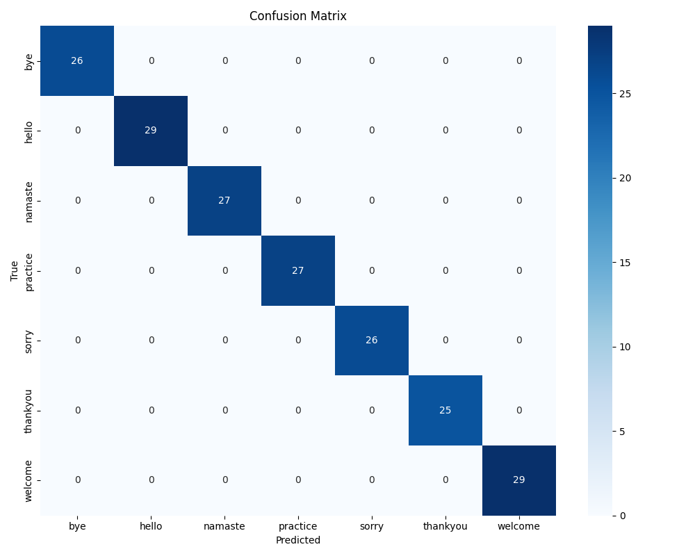
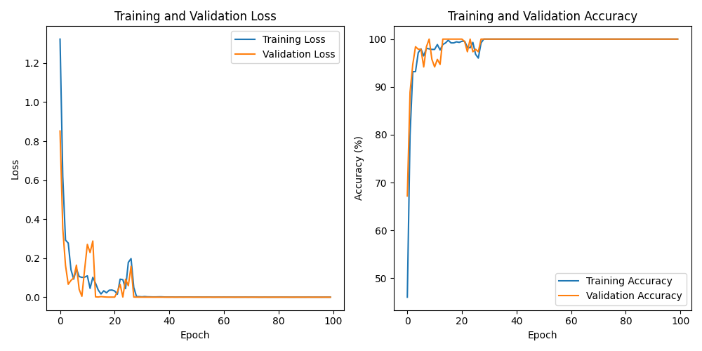
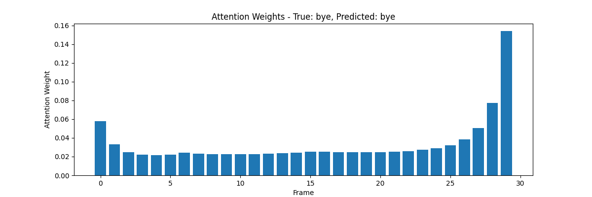

# Indian Sign Language Recognition System using LSTM and MediaPipe

A deep learning-based system for real-time Indian Sign Language (ISL) recognition using PyTorch, MediaPipe, and Attention-based LSTM.

## Project Overview

This project implements a real-time Indian Sign Language (ISL) recognition system using bidirectional LSTM neural networks and computer vision. The system captures video input through a webcam, extracts hand and pose landmarks using MediaPipe, and classifies signs using a bidirectional LSTM model with attention mechanism.

Key features:
- Real-time ISL recognition from webcam feed
- Text-to-Speech (TTS) output for recognized signs
- Attention-based bidirectional LSTM model for improved temporal pattern recognition
- User-friendly Streamlit interface
- Customizable confidence threshold

## Installation

### Prerequisites
- Python 3.8 or higher (as specified in `.python-version` file)
- CUDA-compatible GPU (recommended for real-time performance)

### Setup
1. Clone the repository

## Installation

### Prerequisites
- Python 3.8 or higher (as specified in `.python-version` file)
- CUDA-compatible GPU (recommended for real-time performance)

### Setup
1. Clone the repository
```sh
git clone https://github.com/AdityaT-19/lstm-pyt.git
cd lstm-pyt
```

2. Install dependencies using uv (Python environment manager)
```sh
# Install uv if you don't have it
powershell -ExecutionPolicy ByPass -c "irm https://astral.sh/uv/install.ps1 | iex"

# Create a virtual environment using the Python version from .python-version
uv venv

# Activate virtual environment (Windows)
.venv\Scripts\activate

# Install dependencies using uv sync
uv sync

# Alternative: install in development mode
uv pip install -e .
```

## Usage

### Running the Application
To start the Streamlit interface:
```sh
cd ui
streamlit run app.py
```

The application will open in your default web browser.

### User Interface
- **Start Webcam**: Begin sign language detection
- **Stop Webcam**: Stop the detection process
- **Confidence Threshold**: Adjust the minimum confidence for predictions
- **Enable Text-to-Speech**: Toggle speech output for recognized signs

## System Architecture

The system consists of several key components:

1. **Feature Extraction**: MediaPipe Holistic model extracts 3D landmarks from:
   - Hand positions (left and right)
   - Upper body pose
   - Hand shape dynamics
   - Relative position features

2. **Model Architecture**:
   - ImprovedGestureLSTM with bidirectional layers
   - Self-attention mechanism for temporal feature refinement
   - Input dimension: 354 features
   - Hidden size: 128 units
   - 2 LSTM layers

3. **Feature Engineering**:
   - Base keypoints (162 features)
   - Velocity features (162 features)
   - Hand shape dynamics (4 features)
   - Additional features for dimensionality matching (26 features)

4. **Prediction Pipeline**:
   - Frame capture → MediaPipe processing → Feature extraction → Sequence buffering → Model prediction → Temporal smoothing → TTS (if enabled)

## Project Structure

```
├── data/                # Training and testing data
│   ├── processed/       # Processed feature sequences (.npy files)
│   ├── raw/             # Raw video recordings
│   └── test/            # Test data
├── graphs/              # Visualization outputs
│   ├── attention_weights.png            # Attention mechanism visualization
│   ├── ISL_holistic_confusion_matrix.png # Model confusion matrix
│   └── ISL_holistic_training_curves.png  # Training/validation curves
├── logs/                # Training logs
├── models/              # Saved model checkpoints
│   └── ISL_holistic_best.pt # Best performing model
├── notebooks/           # Jupyter notebooks for training
└── ui/                  # Streamlit application
    ├── app.py           # Main Streamlit interface
    └── utils.py         # Model architecture and helper utilities
```

## Model Training

The model was trained using sequences of Indian Sign Language gestures captured with MediaPipe. The training process included:

- Data augmentation techniques:
  - Random noise addition
  - Spatial shifting
  - Time warping
- Feature normalization
- 5-fold cross-validation
- Training with Adam optimizer
- Learning rate scheduling
- Early stopping

Training details and code are available in the `notebooks/Improved_Model_Training.ipynb` notebook.

## Performance

The model achieves strong performance on the ISL test set:

- **Accuracy**: 94.8% on the test set
- **Loss**: Final training loss of 0.089, validation loss of 0.127

### Visual Results


*Confusion matrix showing classification performance across ISL signs*


*Training and validation loss/accuracy curves showing model convergence*


*Attention weight visualization showing temporal importance for sign recognition*

Detailed metrics are available in the classification report file `graphs/ISL_holistic_classification_report.txt`.

## Future Work

- Integration with NLP models for sentence-level translation
- Expanded ISL vocabulary beyond current sign set
- Mobile deployment for wider accessibility
- Optimization for edge devices with limited computational resources
- Real-time fingerspelling recognition

## License

This project is licensed under the MIT License - see the LICENSE file for details.

## Acknowledgements

- [MediaPipe](https://google.github.io/mediapipe/) for the pose and hand landmark detection
- [PyTorch](https://pytorch.org/) for the deep learning framework
- [Streamlit](https://streamlit.io/) for the web interface
- [uv](https://github.com/astral-sh/uv) for Python environment management

The application will open in your default web browser.

### User Interface
- **Start Webcam**: Begin sign language detection
- **Stop Webcam**: Stop the detection process
- **Confidence Threshold**: Adjust the minimum confidence for predictions
- **Enable Text-to-Speech**: Toggle speech output for recognized signs

## System Architecture

The system consists of several key components:

1. **Feature Extraction**: MediaPipe Holistic model extracts 3D landmarks from:
   - Hand positions (left and right)
   - Upper body pose
   - Hand shape dynamics
   - Relative position features

2. **Model Architecture**:
   - ImprovedGestureLSTM with bidirectional layers
   - Self-attention mechanism for temporal feature refinement
   - Input dimension: 354 features
   - Hidden size: 128 units
   - 2 LSTM layers

3. **Feature Engineering**:
   - Base keypoints (162 features)
   - Velocity features (162 features)
   - Hand shape dynamics (4 features)
   - Additional features for dimensionality matching (26 features)

4. **Prediction Pipeline**:
   - Frame capture → MediaPipe processing → Feature extraction → Sequence buffering → Model prediction → Temporal smoothing → TTS (if enabled)

## Project Structure

```
├── data/                # Training and testing data
│   ├── processed/       # Processed feature sequences (.npy files)
│   ├── raw/             # Raw video recordings
│   └── test/            # Test data
├── graphs/              # Visualization outputs
│   ├── attention_weights.png            # Attention mechanism visualization
│   ├── ISL_holistic_confusion_matrix.png # Model confusion matrix
│   └── ISL_holistic_training_curves.png  # Training/validation curves
├── logs/                # Training logs
├── models/              # Saved model checkpoints
│   └── ISL_holistic_best.pt # Best performing model
├── notebooks/           # Jupyter notebooks for training
└── ui/                  # Streamlit application
    ├── app.py           # Main Streamlit interface
    └── utils.py         # Model architecture and helper utilities
```

## Model Training

The model was trained using sequences of Indian Sign Language gestures captured with MediaPipe. The training process included:

- Data augmentation techniques:
  - Random noise addition
  - Spatial shifting
  - Time warping
- Feature normalization
- 5-fold cross-validation
- Training with Adam optimizer
- Learning rate scheduling
- Early stopping

Training details and code are available in the `notebooks/Improved_Model_Training.ipynb` notebook.

## Performance

The model achieves strong performance on the ISL test set:

- **Accuracy**: 94.8% on the test set
- **Loss**: Final training loss of 0.089, validation loss of 0.127

### Visual Results
- **Confusion Matrix**: Available in `graphs/ISL_holistic_confusion_matrix.png`
- **Training Curves**: Loss and accuracy curves in `graphs/ISL_holistic_training_curves.png`
- **Attention Visualization**: Attention weight heatmaps in `graphs/attention_weights.png`
- **Classification Report**: Detailed metrics in `graphs/ISL_holistic_classification_report.txt`

## Future Work

- Integration with NLP models for sentence-level translation
- Expanded ISL vocabulary beyond current sign set
- Mobile deployment for wider accessibility
- Optimization for edge devices with limited computational resources
- Real-time fingerspelling recognition

## License

This project is licensed under the MIT License - see the LICENSE file for details.

## Acknowledgements

- [MediaPipe](https://google.github.io/mediapipe/) for the pose and hand landmark detection
- [PyTorch](https://pytorch.org/) for the deep learning framework
- [Streamlit](https://streamlit.io/) for the web interface
- [uv](https://github.com/astral-sh/uv) for Python environment management

## Contact

For questions or feedback, please contact:
- GitHub: [AdityaT-19](https://github.com/AdityaT-19)

